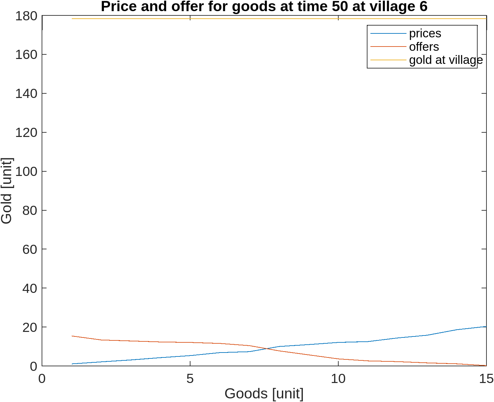
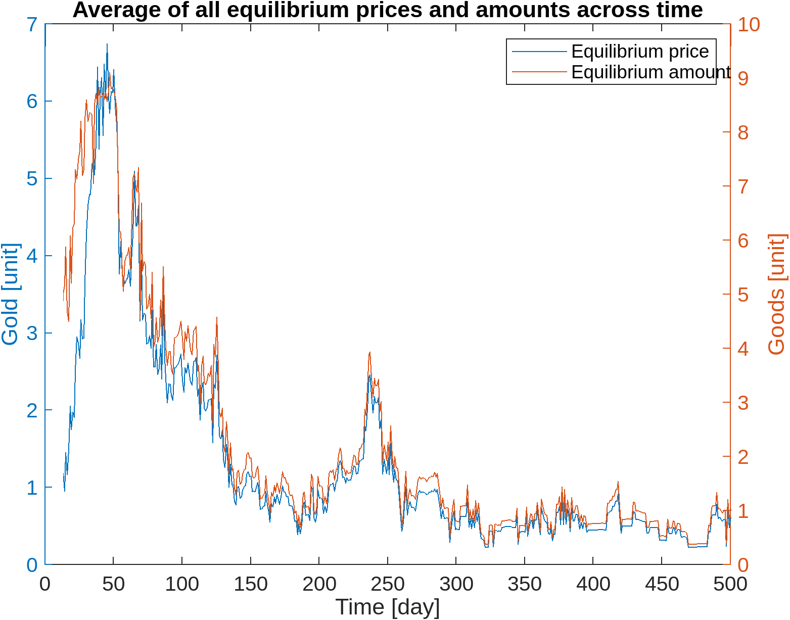
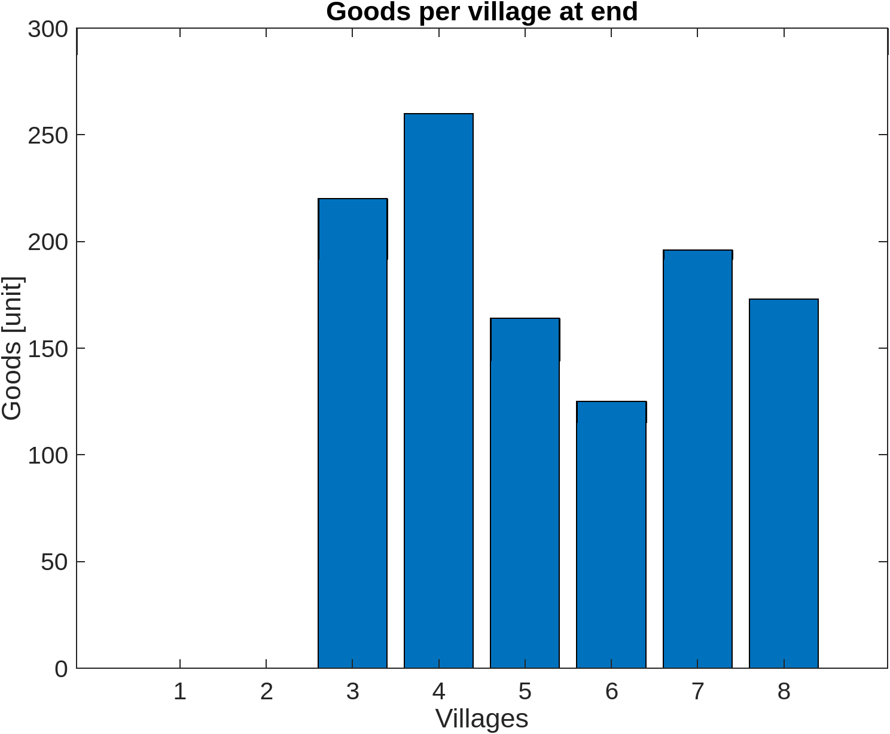

# RimworldCommerceSimulator

## Basic idea

There are a series of villages that commerce between them.

Assumptions:

* There is a single good
* There are consumer and producer villages
* Each path between two villages adds a tranport cost to the good
* The transport cost is proportional to the cost of the good
* Each village extracts a random amount of gold each timestep
* The offer price of the consumers increases with each gold extracted
* Time is discrete (in days)

## Simulator design

### Village types

Villages are divided into three types:

* Producers: Produces the goods for a fixed cost each timestep
* Consumers: Consumes a certain amount of goods each timestep
* Traders: Try to learn the real equilibrium price for the good at each timestep, meanwhile it buys and sells goods

### Villages and caravans

Villages send out a caravan every T time, where T follows an Erlang distribution. The idea is that a caravan exiting the village is a [poisson point process](https://en.wikipedia.org/wiki/Poisson_point_process). The mean round trip time is given by the `distances` digraph:

### Gold extraction

Every village has raw gold waiting to be extracted. The gold extraction is done each timestep, with a Poisson distribution with mean given by the `meanOreExtraction` for each time t:

This function is $f(t) = a e^{bt} (1 - e^{-t})$. The parameters $b$ and $a$ are given by the system of equations:

$$ max = \int_{0}^{\inf} f(t) dx = \frac{a}{b^2-b} $$

$$ total = a e^{b ln(\frac{b-1}{b})} (1 - e^{-ln(\frac{b-1}{b})}) $$

Where `max` is the maximum gold extraction in a day and `total` is the total extraction in a village's lifetime.

Real accumulated extraction for each time step is given at random with Poisson distribution for each timestep, here is an example run:

For consumer villages, the gold extracted is used to increase the gold offered for each unit of the good. Also, the consumer villagers can never offer, more gold than is available at the village, if the offer is too high, it is updated maintaining the function slope.

### Transport costs

Traveling from village to village costs money, when a caravan travels from a village and back, it will try to buy goods from the other village, when buying it will use the `costs` digraph to calculate a "transport cost" that is proportional to the price payed for the goods:

### Supply and demand and prices

Each time a village sends a caravan, the offers and prices are equilized, and a new equilibrium price is calculated with the following equation:

$$ \Delta price = \alpha (priceA - priceB) $$

$$ priceA = priceA - \Delta price $$

$$ priceB = priceB + \Delta price $$

$$ \Delta offer = \alpha (offerA - offerB) $$

$$ offerA = offerA - \Delta offer $$

$$ offerB = offerB + \Delta offer $$

Here is an example supply and demand graph:

I call "offer" the amount the village thinks someone will pay for the good. I call "price" is the amount the village thinks someone will give up the good for. At the intersection is the guess for an equilibrium price.

#### Trades

A graph of the trades at each timepoint:

The average equilibrium price at each timepoint:

### Goods production

At each timestep, the producer villages check if the offers are higher than the cost of producing the goods. It producers until the inventory is full or the offers are too low to cover the costs.

## Results

The simulation was run with 500 timesteps and the previously shown configuration. The producers are 1 and 8, the consumers are 3 and 4:

### Aggregate gold at the end

### Aggregate goods at end

## Known issues

### Traders will bankrupt themselves

Trader villages have no memory, so will buy until their guessed equilibrium price says the price is too high. This means that when all the gold is extracted, they end up with lots of unsold goods that consumers have no gold for.

Traders should probably use the newsvendor model:

$$ q = F^{-1} (\frac{p-c}{p}) $$

Although the goods are not perishible, the consumers are, this means that at some point the consumers with "run out", effectively destroying the goods value (see price graph).

### Price update is somewhat broken

The price equilibrium updating from village to village has problems keeping track of travel costs and the update function is too unrealistic.

### The model does not support perishable goods

This model is somewhat easily extended to perishable products. The only issue is that each perishable product has a memory, so they are not fungible anymore, this implies that when the product is near its expiration, the price decreases.

The probability function for a good getting bad is: 

$$ f(t) = min(S^{T-t},1) $$

$T$ is the time when the product "dies". $S$ is the probability of selling the good in a single day.
